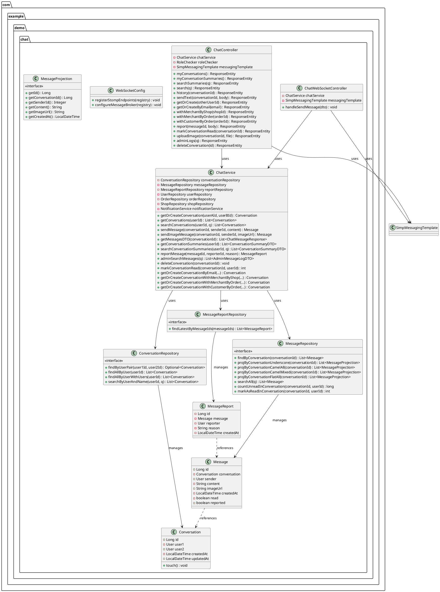
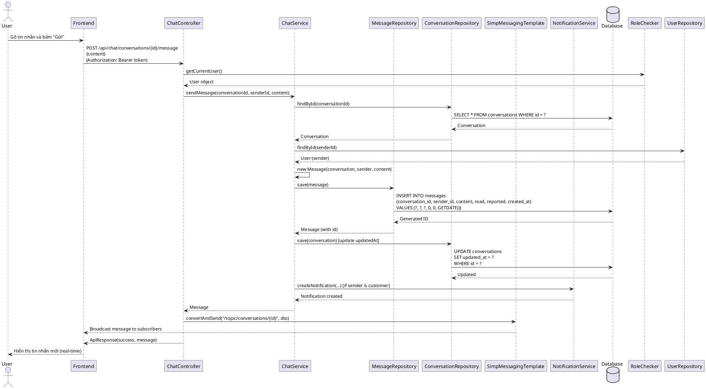
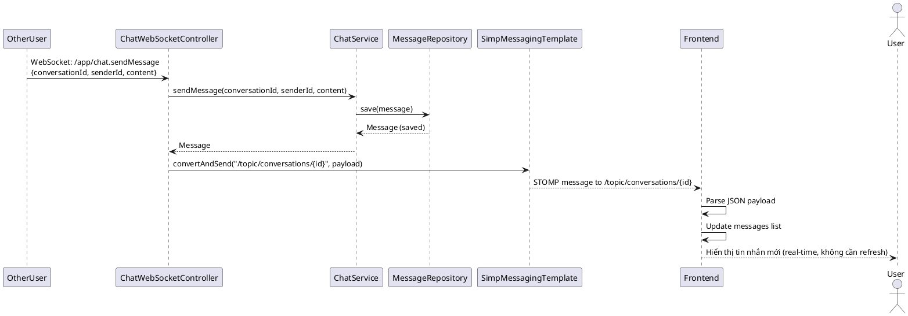
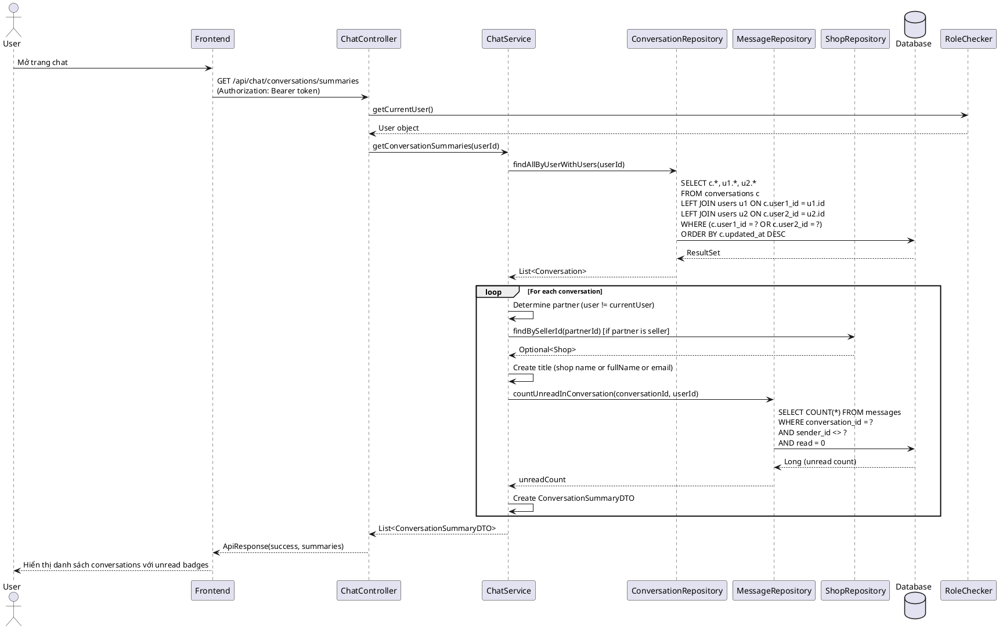
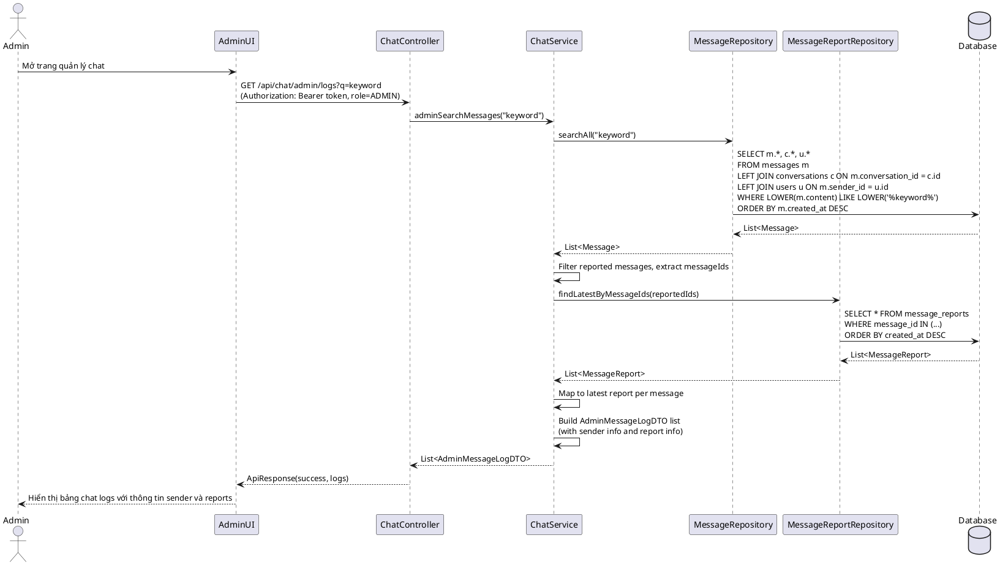
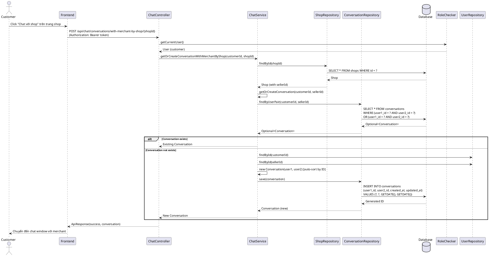

# 3. CHAT MODULE

## 3.1. Class Diagram



## 3.2. Class Specifications

### 3.2.1. Conversation (Entity)

**Mục đích**: Entity class đại diện cho bảng `conversations`, lưu trữ cuộc trò chuyện giữa 2 users.

**Thuộc tính**:
- `id` (Long): Primary key, tự động tăng
- `user1` (User, ManyToOne): User thứ nhất (NOT NULL, LAZY fetch)
- `user2` (User, ManyToOne): User thứ hai (NOT NULL, LAZY fetch)
- `createdAt` (LocalDateTime): Thời gian tạo conversation
- `updatedAt` (LocalDateTime): Thời gian cập nhật (tự động update khi có message mới)

**Unique Constraint**: `(user1_id, user2_id)` - đảm bảo chỉ có 1 conversation giữa 2 users

**Phương thức đặc biệt**:
- `touch()`: JPA callback, tự động set `updatedAt = now()` khi entity được update

**Constructor**:
- `Conversation()`: Constructor mặc định cho JPA
- `Conversation(user1, user2)`: Constructor tự động sắp xếp user1 và user2 theo ID (user có ID nhỏ hơn là user1) để đảm bảo uniqueness

---

### 3.2.2. Message (Entity)

**Mục đích**: Entity class đại diện cho bảng `messages`, lưu trữ tin nhắn trong conversation.

**Thuộc tính**:
- `id` (Long): Primary key, tự động tăng
- `conversation` (Conversation, ManyToOne): Conversation chứa message này (NOT NULL, LAZY fetch)
- `sender` (User, ManyToOne): User gửi message (NOT NULL, LAZY fetch)
- `content` (String, max 2000): Nội dung tin nhắn (NOT NULL)
- `imageUrl` (String): URL ảnh đính kèm (NULLABLE)
- `createdAt` (LocalDateTime): Thời gian gửi, tự động set (NOT NULL)
- `read` (boolean): Trạng thái đã đọc/chưa đọc, mặc định false
- `reported` (boolean): Trạng thái đã bị báo cáo, mặc định false

**Business Rules**:
- Message có thể có `content` HOẶC `imageUrl` hoặc cả hai
- `read` flag được set khi receiver đánh dấu conversation là đã đọc

---

### 3.2.3. MessageReport (Entity)

**Mục đích**: Entity class đại diện cho bảng `message_reports`, lưu trữ báo cáo về tin nhắn không phù hợp.

**Thuộc tính**:
- `id` (Long): Primary key, tự động tăng
- `message` (Message, ManyToOne): Message bị báo cáo (NOT NULL, LAZY fetch)
- `reporter` (User, ManyToOne): User báo cáo (NOT NULL, LAZY fetch)
- `reason` (String, max 1000): Lý do báo cáo (NULLABLE)
- `createdAt` (LocalDateTime): Thời gian báo cáo, tự động set (NOT NULL)

---

### 3.2.4. ChatService

**Mục đích**: Service layer xử lý business logic cho chat system, bao gồm conversation management, message handling, và notification integration.

**Dependencies**:
- `ConversationRepository`: Repository để truy cập conversations
- `MessageRepository`: Repository để truy cập messages
- `MessageReportRepository`: Repository để truy cập message reports
- `UserRepository`: Repository để truy cập users
- `OrderRepository`: Repository để truy cập orders (cho convenience methods)
- `ShopRepository`: Repository để truy cập shops (cho convenience methods)
- `NotificationService`: Service để gửi notification khi customer gửi tin nhắn cho merchant

**Phương thức chính - Conversation Management**:

1. **getOrCreateConversation(userAId, userBId)**
   - **Mục đích**: Tìm hoặc tạo conversation giữa 2 users
   - **Business Logic**: 
     - Tìm conversation hiện có (không phân biệt thứ tự user1/user2)
     - Nếu không có, tạo mới với user1 và user2 được sắp xếp theo ID
   - **Return**: Conversation (existing or new)

2. **getConversations(userId)**
   - **Mục đích**: Lấy tất cả conversations của user
   - **Return**: List<Conversation>

3. **searchConversations(userId, q)**
   - **Mục đích**: Tìm conversations theo tên/email của partner
   - **Return**: List<Conversation>

**Phương thức chính - Message Handling**:

4. **sendMessage(conversationId, senderId, content)**
   - **Mục đích**: Gửi tin nhắn text
   - **Business Logic**:
     - Tạo Message mới, set conversation, sender, content
     - Cập nhật `conversation.updatedAt` = message.createdAt
     - Gửi notification cho merchant nếu sender là customer
   - **Return**: Message đã được lưu

5. **sendImageMessage(conversationId, senderId, imageUrl)**
   - **Mục đích**: Gửi tin nhắn ảnh
   - **Business Logic**: Tương tự sendMessage, nhưng set imageUrl và content = ""
   - **Return**: Message đã được lưu

6. **getMessagesDTO(conversationId)**
   - **Mục đích**: Lấy danh sách messages của conversation dưới dạng DTO
   - **Business Logic**: 
     - Thử nhiều projection queries (fallback cho các schema khác nhau)
     - Nếu projection fail, fallback về JPA entity mapping
   - **Return**: List<ChatMessageResponse>

7. **markConversationRead(conversationId, userId)**
   - **Mục đích**: Đánh dấu tất cả messages trong conversation là đã đọc (cho user cụ thể)
   - **Business Logic**: Update tất cả messages mà sender != userId và read = false
   - **Return**: int (số messages đã được đánh dấu)

**Phương thức chính - Conversation Summaries**:

8. **getConversationSummaries(userId)**
   - **Mục đích**: Lấy danh sách conversations với thông tin tóm tắt (title, unread count)
   - **Business Logic**:
     - Lấy conversations với eager fetch users
     - Với mỗi conversation, xác định partner (user khác với userId)
     - Tạo title từ shop name (nếu partner là seller) hoặc fullName/email
     - Đếm số unread messages
   - **Return**: List<ConversationSummaryDTO>

9. **searchConversationSummaries(userId, q)**
   - **Mục đích**: Tìm conversations với summaries
   - **Return**: List<ConversationSummaryDTO>

**Phương thức chính - Message Reporting**:

10. **reportMessage(messageId, reporterId, reason)**
    - **Mục đích**: Báo cáo tin nhắn không phù hợp
    - **Business Logic**:
      - Set `message.reported = true`
      - Tạo MessageReport mới
    - **Return**: MessageReport đã được lưu

**Phương thức chính - Admin**:

11. **adminSearchMessages(q)**
    - **Mục đích**: Admin tìm kiếm messages (với thông tin sender và report)
    - **Business Logic**:
      - Tìm messages theo content (nếu q không null)
      - Eager fetch conversation và sender để tránh lazy loading
      - Lấy latest report cho mỗi reported message
      - Map sang AdminMessageLogDTO
    - **Return**: List<AdminMessageLogDTO>

12. **deleteConversation(conversationId)**
    - **Mục đích**: Admin xóa conversation (cascade delete messages)
    - **Return**: void

**Convenience Methods**:

13. **getOrCreateConversationByEmail(currentUserId, otherEmail)**: Tạo conversation với user khác qua email
14. **getOrCreateConversationWithMerchantByShop(currentUserId, shopId)**: Customer tạo conversation với merchant qua shopId
15. **getOrCreateConversationWithMerchantByOrder(currentUserId, orderId)**: Tạo conversation với merchant qua orderId
16. **getOrCreateConversationWithCustomerByOrder(currentUserId, orderId)**: Merchant/Shipper tạo conversation với customer qua orderId

---

### 3.2.5. ChatController

**Mục đích**: REST API controller xử lý HTTP requests cho chat endpoints.

**Base Path**: `/api/chat`

**Dependencies**:
- `ChatService`: Service layer
- `RoleChecker`: Utility để lấy current user từ JWT token
- `SimpMessagingTemplate`: Spring WebSocket template để broadcast messages

**Endpoints cho User (yêu cầu authentication)**:

1. **GET `/conversations`**
   - **Mục đích**: Lấy danh sách conversations
   - **Security**: `@PreAuthorize("isAuthenticated()")`
   - **Return**: `ApiResponse<List<Conversation>>`

2. **GET `/conversations/summaries`**
   - **Mục đích**: Lấy danh sách conversations với summaries (title, unread count)
   - **Security**: `@PreAuthorize("isAuthenticated()")`
   - **Return**: `ApiResponse<List<ConversationSummaryDTO>>`

3. **GET `/conversations/search-summaries?q=...`**
   - **Mục đích**: Tìm conversations với summaries
   - **Security**: `@PreAuthorize("isAuthenticated()")`
   - **Return**: `ApiResponse<List<ConversationSummaryDTO>>`

4. **GET `/conversations/search?q=...`**
   - **Mục đích**: Tìm conversations theo tên/email
   - **Security**: `@PreAuthorize("isAuthenticated()")`
   - **Return**: `ApiResponse<List<Conversation>>`

5. **GET `/conversations/{id}/messages`**
   - **Mục đích**: Lấy lịch sử messages của conversation
   - **Security**: `@PreAuthorize("isAuthenticated()")`
   - **Return**: `ApiResponse<List<ChatMessageResponse>>`

6. **POST `/conversations/{id}/message`**
   - **Mục đích**: Gửi tin nhắn text (persist + broadcast via WebSocket)
   - **Security**: `@PreAuthorize("isAuthenticated()")`
   - **Request body**: `{content}`
   - **Return**: `ApiResponse<ChatMessageResponse>`
   - **Note**: Sau khi persist, broadcast qua WebSocket `/topic/conversations/{id}`

7. **POST `/conversations/{id}/image`**
   - **Mục đích**: Upload và gửi tin nhắn ảnh
   - **Security**: `@PreAuthorize("isAuthenticated()")`
   - **Request**: Multipart form data với field `file`
   - **Return**: `ApiResponse<ChatMessageResponse>`

8. **POST `/conversations/{id}/read`**
   - **Mục đích**: Đánh dấu conversation là đã đọc
   - **Security**: `@PreAuthorize("isAuthenticated()")`
   - **Return**: `ApiResponse<Integer>` (số messages đã đánh dấu)

9. **POST `/conversations/with/{otherUserId}`**
   - **Mục đích**: Tạo hoặc lấy conversation với user khác
   - **Security**: `@PreAuthorize("isAuthenticated()")`
   - **Return**: `ApiResponse<Conversation>`

10. **POST `/conversations/with-email?email=...`**
    - **Mục đích**: Tạo hoặc lấy conversation với user khác qua email
    - **Security**: `@PreAuthorize("isAuthenticated()")`
    - **Return**: `ApiResponse<Conversation>`

11. **POST `/conversations/with-merchant-by-shop/{shopId}`**
    - **Mục đích**: Customer tạo conversation với merchant qua shopId
    - **Security**: `@PreAuthorize("isAuthenticated()")`
    - **Return**: `ApiResponse<Conversation>`

12. **POST `/conversations/with-merchant-by-order/{orderId}`**
    - **Mục đích**: Tạo conversation với merchant qua orderId
    - **Security**: `@PreAuthorize("isAuthenticated()")`
    - **Return**: `ApiResponse<Conversation>`

13. **POST `/conversations/with-customer-by-order/{orderId}`**
    - **Mục đích**: Merchant/Shipper tạo conversation với customer qua orderId
    - **Security**: `@PreAuthorize("isAuthenticated()")`
    - **Return**: `ApiResponse<Conversation>`

14. **POST `/messages/{messageId}/report`**
    - **Mục đích**: Báo cáo tin nhắn không phù hợp
    - **Security**: `@PreAuthorize("isAuthenticated()")`
    - **Request body**: `{reason}`
    - **Return**: `ApiResponse<MessageReportResponse>`

**Endpoints cho Admin**:

15. **GET `/admin/logs?q=...`**
    - **Mục đích**: Admin xem log messages (với filter theo content)
    - **Security**: `@PreAuthorize("hasRole('ADMIN')")`
    - **Return**: `ApiResponse<List<Message>>`

16. **DELETE `/admin/conversations/{id}`**
    - **Mục đích**: Admin xóa conversation
    - **Security**: `@PreAuthorize("hasRole('ADMIN')")`
    - **Return**: `ApiResponse<String>`

---

### 3.2.6. ChatWebSocketController

**Mục đích**: WebSocket controller xử lý real-time messaging qua STOMP protocol.

**Message Mapping**: `/app/chat.sendMessage`

**Dependencies**:
- `ChatService`: Service layer
- `SimpMessagingTemplate`: Template để broadcast messages

**Phương thức**:

1. **handleSendMessage(dto)**
   - **Mục đích**: Xử lý tin nhắn gửi qua WebSocket
   - **Input**: `ChatMessageDTO` (conversationId, senderId, content)
   - **Business Logic**:
     - Validate dto (không null, có conversationId và senderId)
     - Gọi `chatService.sendMessage()` để persist
     - Broadcast lightweight payload đến `/topic/conversations/{conversationId}`
   - **Return**: void

**Broadcast Format**:
```json
{
  "id": <messageId>,
  "conversationId": <conversationId>,
  "senderId": <senderId>,
  "content": "<content>",
  "createdAt": "<ISO datetime>"
}
```

---

### 3.2.7. WebSocketConfig

**Mục đích**: Spring configuration class để cấu hình WebSocket/STOMP.

**Configuration**:

1. **STOMP Endpoint**: `/ws-chat`
   - Sử dụng SockJS để hỗ trợ fallback cho browsers không hỗ trợ WebSocket
   - Allowed origins: `*` (có thể restrict trong production)

2. **Message Broker**:
   - Simple broker cho topics: `/topic`, `/queue`
   - Application destination prefix: `/app`

**Client Connection**:
- WebSocket URL: `ws://localhost:8080/ws-chat`
- Subscribe to: `/topic/conversations/{conversationId}`
- Send to: `/app/chat.sendMessage`

---

### 3.2.8. ConversationRepository

**Mục đích**: Spring Data JPA Repository interface để truy cập bảng `conversations`.

**Extends**: `JpaRepository<Conversation, Long>`

**Custom Query Methods**:

1. **findByUserPair(user1Id, user2Id)** (JPQL)
   - Tìm conversation giữa 2 users (không phân biệt thứ tự)
   - Query: `SELECT c FROM Conversation c WHERE (c.user1.id = :u1 AND c.user2.id = :u2) OR (c.user1.id = :u2 AND c.user2.id = :u1)`

2. **findAllByUser(userId)** (JPQL)
   - Lấy tất cả conversations của user
   - Query: `SELECT c FROM Conversation c WHERE c.user1.id = :uid OR c.user2.id = :uid ORDER BY c.updatedAt DESC`

3. **findAllByUserWithUsers(userId)** (JPQL với eager fetch)
   - Lấy conversations với eager fetch users (tránh LazyInitializationException)
   - Query: `SELECT c FROM Conversation c LEFT JOIN FETCH c.user1 LEFT JOIN FETCH c.user2 WHERE c.user1.id = :uid OR c.user2.id = :uid ORDER BY c.updatedAt DESC`

4. **searchByUserAndName(userId, q)** (JPQL với eager fetch)
   - Tìm conversations theo tên partner
   - Query: `SELECT c FROM Conversation c LEFT JOIN FETCH c.user1 LEFT JOIN FETCH c.user2 WHERE (c.user1.id = :uid OR c.user2.id = :uid) AND (LOWER(c.user1.fullName) LIKE LOWER(CONCAT('%', :q, '%')) OR LOWER(c.user2.fullName) LIKE LOWER(CONCAT('%', :q, '%'))) ORDER BY c.updatedAt DESC`

---

### 3.2.9. MessageRepository

**Mục đích**: Spring Data JPA Repository interface để truy cập bảng `messages`.

**Extends**: `JpaRepository<Message, Long>`

**Custom Query Methods**:

1. **findByConversation(conversationId)** (JPQL)
   - Lấy tất cả messages của conversation, sắp xếp theo thời gian
   - Query: `SELECT m FROM Message m WHERE m.conversation.id = :cid ORDER BY m.createdAt ASC`

2. **projByConversationUnderscore(conversationId)** (Native Query - Projection)
   - Fallback query cho schema với underscore naming
   - Query: `SELECT id, conversation_id, sender_id, content, image_url, created_at FROM messages WHERE conversation_id = :cid ORDER BY created_at ASC`

3. **projByConversationCamelAll(conversationId)** (Native Query - Projection)
   - Fallback query cho schema với camelCase naming
   - Query: `SELECT id, conversationId, senderId, content, imageUrl, createdAt FROM messages WHERE conversationId = :cid ORDER BY createdAt ASC`

4. **projByConversationCamelMixed(conversationId)** (Native Query - Projection)
   - Fallback query cho schema mixed naming
   - Query: `SELECT id, conversationId, sender_id, content, image_url, created_at FROM messages WHERE conversationId = :cid ORDER BY created_at ASC`

5. **projByConversationFlatAll(conversationId)** (Native Query - Projection)
   - Fallback query cho schema với flat naming
   - Query: `SELECT id, conversationid, senderid, content, imageurl, createdat FROM messages WHERE conversationid = :cid ORDER BY createdat ASC`

6. **searchAll(q)** (JPQL với eager fetch)
   - Admin tìm kiếm messages theo content
   - Query: `SELECT m FROM Message m LEFT JOIN FETCH m.conversation LEFT JOIN FETCH m.sender WHERE (:q IS NULL OR LOWER(m.content) LIKE LOWER(CONCAT('%', :q, '%'))) ORDER BY m.createdAt DESC`

7. **countUnreadInConversation(conversationId, userId)** (JPQL)
   - Đếm số messages chưa đọc trong conversation (cho user cụ thể)
   - Query: `SELECT COUNT(m) FROM Message m WHERE m.conversation.id = :cid AND m.sender.id <> :uid AND m.read = false`

8. **markAsReadInConversation(conversationId, userId)** (JPQL - Modifying)
   - Đánh dấu messages là đã đọc
   - Query: `UPDATE Message m SET m.read = true WHERE m.conversation.id = :cid AND m.sender.id <> :uid AND m.read = false`
   - **Note**: Phải có `@Modifying` annotation

---

### 3.2.10. MessageReportRepository

**Mục đích**: Spring Data JPA Repository interface để truy cập bảng `message_reports`.

**Extends**: `JpaRepository<MessageReport, Long>`

**Custom Query Methods**:

1. **findLatestByMessageIds(messageIds)** (JPQL)
   - Lấy latest report cho mỗi message (dùng cho admin logs)
   - Query: `SELECT mr FROM MessageReport mr WHERE mr.message.id IN :messageIds ORDER BY mr.createdAt DESC`
   - **Note**: Service layer sẽ filter để lấy latest report per message

---

## 3.3. Sequence Diagrams

### 3.3.1. User Gửi Tin Nhắn Text (REST + WebSocket)



### 3.3.2. User Nhận Tin Nhắn Real-time (WebSocket)



### 3.3.3. User Xem Danh Sách Conversations



### 3.3.4. Admin Xem Chat Logs



### 3.3.5. Customer Tạo Conversation Với Merchant



---

## 3.4. Database Queries

### 3.4.1. Schema

**Table: `conversations`**

```sql
CREATE TABLE conversations (
    id BIGINT IDENTITY(1,1) PRIMARY KEY,
    user1_id INT NOT NULL,
    user2_id INT NOT NULL,
    created_at DATETIME2 NOT NULL DEFAULT GETDATE(),
    updated_at DATETIME2 NOT NULL DEFAULT GETDATE(),
    FOREIGN KEY (user1_id) REFERENCES users(id),
    FOREIGN KEY (user2_id) REFERENCES users(id),
    UNIQUE (user1_id, user2_id)
);

CREATE INDEX idx_conversations_user1_id ON conversations(user1_id);
CREATE INDEX idx_conversations_user2_id ON conversations(user2_id);
CREATE INDEX idx_conversations_updated_at ON conversations(updated_at DESC);
```

**Table: `messages`**

```sql
CREATE TABLE messages (
    id BIGINT IDENTITY(1,1) PRIMARY KEY,
    conversation_id BIGINT NOT NULL,
    sender_id INT NOT NULL,
    content NVARCHAR(2000) NOT NULL,
    image_url NVARCHAR(500) NULL,
    created_at DATETIME2 NOT NULL DEFAULT GETDATE(),
    is_read BIT NOT NULL DEFAULT 0,
    is_reported BIT NOT NULL DEFAULT 0,
    FOREIGN KEY (conversation_id) REFERENCES conversations(id) ON DELETE CASCADE,
    FOREIGN KEY (sender_id) REFERENCES users(id)
);

CREATE INDEX idx_messages_conversation_id ON messages(conversation_id);
CREATE INDEX idx_messages_sender_id ON messages(sender_id);
CREATE INDEX idx_messages_created_at ON messages(created_at ASC);
CREATE INDEX idx_messages_is_read ON messages(is_read);
CREATE INDEX idx_messages_is_reported ON messages(is_reported);
```

**Table: `message_reports`**

```sql
CREATE TABLE message_reports (
    id BIGINT IDENTITY(1,1) PRIMARY KEY,
    message_id BIGINT NOT NULL,
    reporter_id INT NOT NULL,
    reason NVARCHAR(1000) NULL,
    created_at DATETIME2 NOT NULL DEFAULT GETDATE(),
    FOREIGN KEY (message_id) REFERENCES messages(id),
    FOREIGN KEY (reporter_id) REFERENCES users(id)
);

CREATE INDEX idx_message_reports_message_id ON message_reports(message_id);
CREATE INDEX idx_message_reports_reporter_id ON message_reports(reporter_id);
CREATE INDEX idx_message_reports_created_at ON message_reports(created_at DESC);
```

### 3.4.2. Queries Generated by Spring Data JPA

**1. Tìm conversation giữa 2 users**
```sql
SELECT c FROM Conversation c 
WHERE (c.user1.id = :u1 AND c.user2.id = :u2) 
   OR (c.user1.id = :u2 AND c.user2.id = :u1);
```

**2. Lấy conversations của user (với eager fetch users)**
```sql
SELECT c FROM Conversation c 
LEFT JOIN FETCH c.user1 
LEFT JOIN FETCH c.user2 
WHERE c.user1.id = :uid OR c.user2.id = :uid 
ORDER BY c.updatedAt DESC;
```

**3. Tìm conversations theo tên partner**
```sql
SELECT c FROM Conversation c 
LEFT JOIN FETCH c.user1 
LEFT JOIN FETCH c.user2 
WHERE (c.user1.id = :uid OR c.user2.id = :uid) 
  AND (LOWER(c.user1.fullName) LIKE LOWER(CONCAT('%', :q, '%')) 
       OR LOWER(c.user2.fullName) LIKE LOWER(CONCAT('%', :q, '%'))) 
ORDER BY c.updatedAt DESC;
```

**4. Lấy messages của conversation**
```sql
SELECT m FROM Message m 
WHERE m.conversation.id = :cid 
ORDER BY m.createdAt ASC;
```

**5. Đếm unread messages trong conversation**
```sql
SELECT COUNT(m) FROM Message m 
WHERE m.conversation.id = :cid 
  AND m.sender.id <> :uid 
  AND m.read = false;
```

**6. Đánh dấu messages là đã đọc**
```sql
UPDATE Message m 
SET m.read = true 
WHERE m.conversation.id = :cid 
  AND m.sender.id <> :uid 
  AND m.read = false;
```

**7. Admin tìm kiếm messages (với eager fetch)**
```sql
SELECT m FROM Message m 
LEFT JOIN FETCH m.conversation 
LEFT JOIN FETCH m.sender 
WHERE (:q IS NULL OR LOWER(m.content) LIKE LOWER(CONCAT('%', :q, '%'))) 
ORDER BY m.createdAt DESC;
```

**8. Lấy latest reports cho messages**
```sql
SELECT mr FROM MessageReport mr 
WHERE mr.message.id IN :messageIds 
ORDER BY mr.createdAt DESC;
```

### 3.4.3. Queries Thực Thi Bởi Service Methods

**1. Tạo conversation mới**
```sql
INSERT INTO conversations (user1_id, user2_id, created_at, updated_at)
VALUES (?, ?, GETDATE(), GETDATE());
```

**2. Gửi message mới**
```sql
INSERT INTO messages (conversation_id, sender_id, content, image_url, is_read, is_reported, created_at)
VALUES (?, ?, ?, ?, 0, 0, GETDATE());
```

**3. Cập nhật conversation.updatedAt khi có message mới**
```sql
UPDATE conversations 
SET updated_at = ? 
WHERE id = ?;
```

**4. Báo cáo message**
```sql
-- Set message.is_reported = true
UPDATE messages 
SET is_reported = 1 
WHERE id = ?;

-- Tạo report
INSERT INTO message_reports (message_id, reporter_id, reason, created_at)
VALUES (?, ?, ?, GETDATE());
```

**5. Xóa conversation (cascade delete messages)**
```sql
-- CASCADE DELETE tự động xóa messages và reports
DELETE FROM conversations WHERE id = ?;
```

### 3.4.4. Performance Optimization

- **Indexes**: 
  - Composite index `(conversation_id, created_at)` cho query lấy messages theo conversation
  - Composite index `(conversation_id, sender_id, is_read)` cho query đếm unread messages
  - Index `(is_reported, created_at)` cho admin query reported messages

- **Query Optimization**:
  - Sử dụng eager fetch (`LEFT JOIN FETCH`) để tránh N+1 query problem khi load conversations với users
  - Projection queries (MessageProjection) để giảm memory usage khi chỉ cần một số fields
  - CASCADE DELETE cho messages khi xóa conversation để đảm bảo data integrity

- **WebSocket Optimization**:
  - Broadcast lightweight payload (chỉ gửi ID, content, timestamps) thay vì full entity
  - Sử dụng topic-based subscription (`/topic/conversations/{id}`) để chỉ broadcast cho users trong conversation


