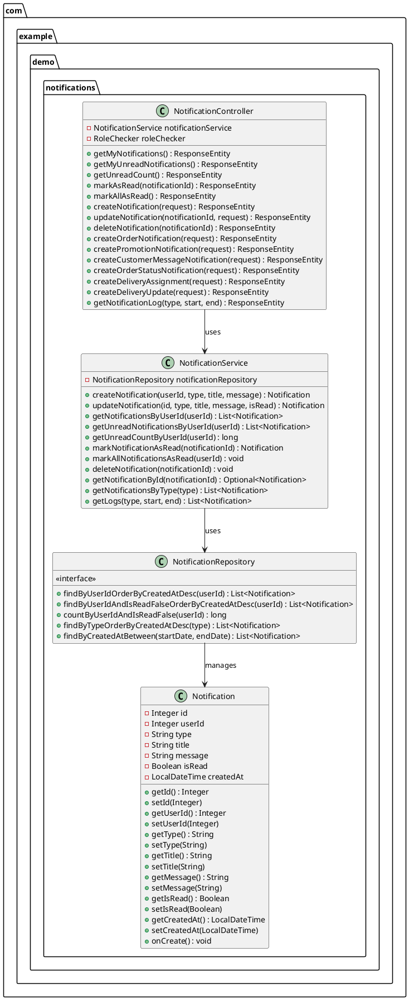
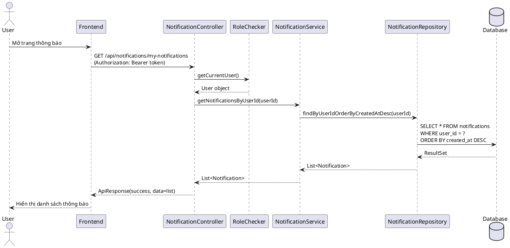
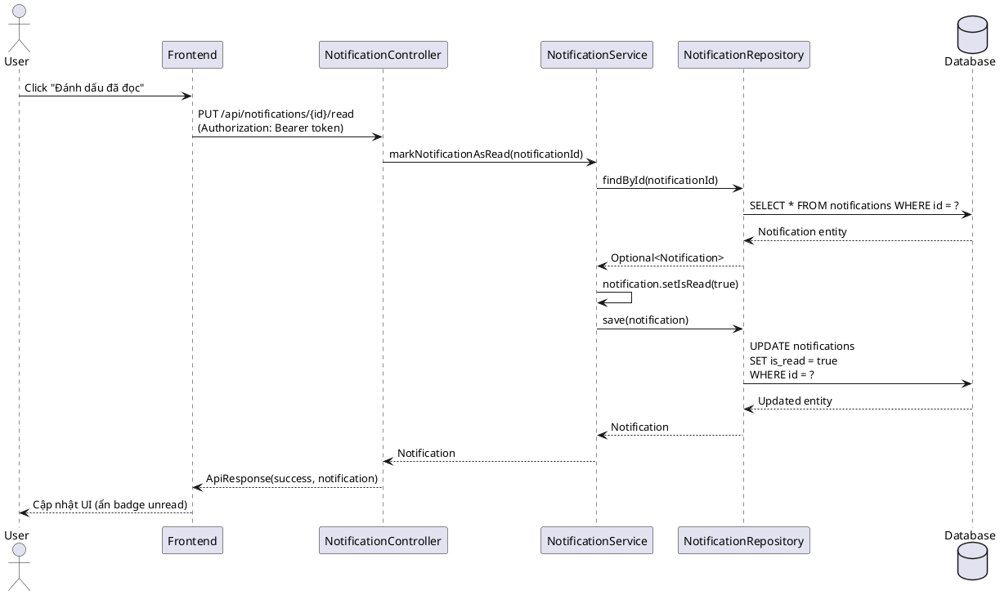
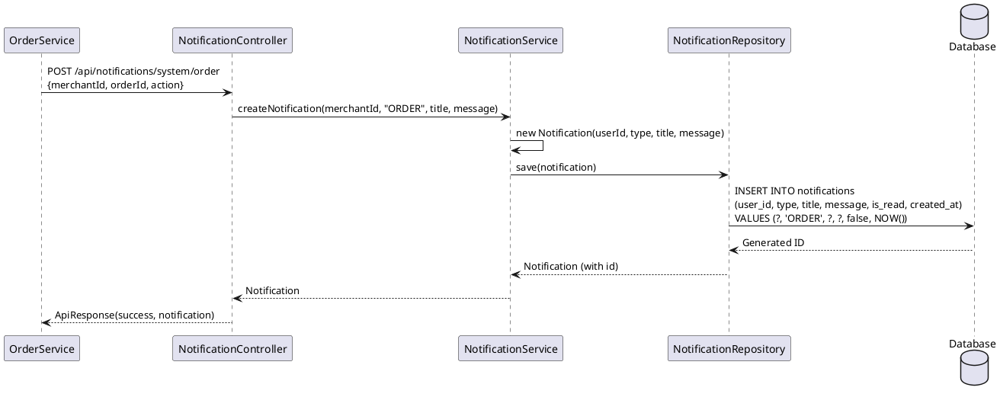
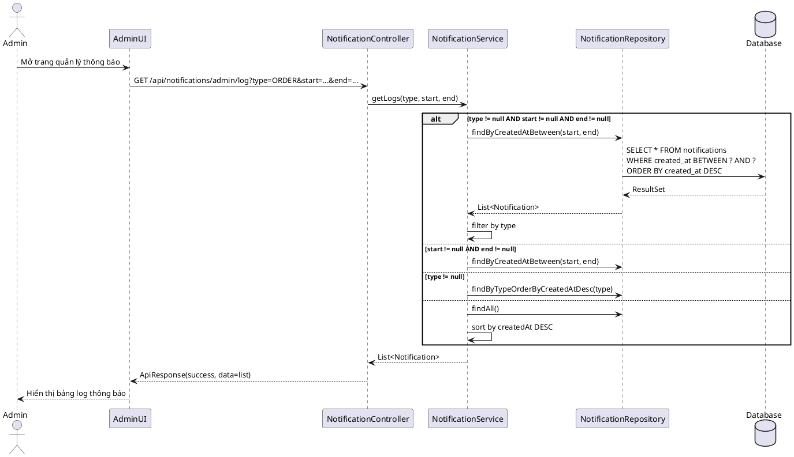

# 1. NOTIFICATION MODULE

## 1.1. Class Diagram



## 1.2. Class Specifications

### 1.2.1. Notification (Entity)

**Mục đích**: Entity class đại diện cho bảng `notifications` trong database.

**Thuộc tính**:
- `id` (Integer): Primary key, tự động tăng
- `userId` (Integer): ID của user nhận thông báo (NOT NULL)
- `type` (String, max 50): Loại thông báo - ORDER, PROMOTION, MESSAGE, DELIVERY, SYSTEM (NOT NULL)
- `title` (String, max 255): Tiêu đề thông báo (NOT NULL)
- `message` (String, TEXT): Nội dung chi tiết thông báo (NOT NULL)
- `isRead` (Boolean): Trạng thái đã đọc/chưa đọc, mặc định false (NOT NULL)
- `createdAt` (LocalDateTime): Thời gian tạo thông báo, tự động set khi persist (NOT NULL)

**Phương thức đặc biệt**:
- `onCreate()`: JPA callback, tự động set `createdAt = LocalDateTime.now()` nếu null

**Constructor**:
- `Notification()`: Constructor mặc định cho JPA
- `Notification(userId, type, title, message)`: Constructor tiện lợi, tự set `isRead = false` và `createdAt = now()`

---

### 1.2.2. NotificationService

**Mục đích**: Service layer xử lý business logic cho notification system.

**Dependencies**:
- `NotificationRepository`: Spring Data JPA repository để truy cập database

**Phương thức chính**:

1. **createNotification(userId, type, title, message)**
   - Tạo notification mới và lưu vào database
   - Return: Notification đã được lưu

2. **updateNotification(id, type, title, message, isRead)**
   - Cập nhật thông tin notification (chỉ update các field không null)
   - Throw RuntimeException nếu không tìm thấy notification
   - Return: Notification đã được cập nhật

3. **getNotificationsByUserId(userId)**
   - Lấy tất cả notifications của user, sắp xếp mới nhất trước
   - Return: List<Notification>

4. **getUnreadNotificationsByUserId(userId)**
   - Lấy danh sách notifications chưa đọc của user
   - Return: List<Notification>

5. **getUnreadCountByUserId(userId)**
   - Đếm số lượng notifications chưa đọc
   - Return: long

6. **markNotificationAsRead(notificationId)**
   - Đánh dấu một notification là đã đọc
   - Throw RuntimeException nếu không tìm thấy
   - Return: Notification đã được cập nhật

7. **markAllNotificationsAsRead(userId)**
   - Đánh dấu tất cả notifications của user là đã đọc
   - Không return value

8. **deleteNotification(notificationId)**
   - Xóa notification khỏi database
   - Throw RuntimeException nếu không tồn tại

9. **getNotificationById(notificationId)**
   - Lấy notification theo ID
   - Return: Optional<Notification>

10. **getNotificationsByType(type)**
    - Lấy tất cả notifications theo loại (ORDER, MESSAGE, etc.)
    - Return: List<Notification>

11. **getLogs(type, start, end)**
    - Lấy log notifications với filter theo type và/hoặc khoảng thời gian
    - Nếu cả type và time range đều null → trả về tất cả, sắp xếp mới nhất trước
    - Return: List<Notification>

---

### 1.2.3. NotificationController

**Mục đích**: REST API controller xử lý HTTP requests cho notification endpoints.

**Base Path**: `/api/notifications`

**Dependencies**:
- `NotificationService`: Service layer
- `RoleChecker`: Utility để lấy current user từ JWT token

**Endpoints cho User (yêu cầu authentication)**:

1. **GET `/my-notifications`**
   - Lấy tất cả notifications của user hiện tại
   - Security: `@PreAuthorize("isAuthenticated()")`
   - Return: `ApiResponse<List<Notification>>`

2. **GET `/unread`**
   - Lấy danh sách notifications chưa đọc
   - Security: `@PreAuthorize("isAuthenticated()")`
   - Return: `ApiResponse<List<Notification>>`

3. **GET `/unread-count`**
   - Đếm số notifications chưa đọc
   - Security: `@PreAuthorize("isAuthenticated()")`
   - Return: `ApiResponse<Long>`

4. **PUT `/{notificationId}/read`**
   - Đánh dấu một notification là đã đọc
   - Security: `@PreAuthorize("isAuthenticated()")`
   - Return: `ApiResponse<Notification>`

5. **PUT `/mark-all-read`**
   - Đánh dấu tất cả notifications là đã đọc
   - Security: `@PreAuthorize("isAuthenticated()")`
   - Return: `ApiResponse<String>`

**Endpoints cho Admin**:

6. **POST `/`**
   - Tạo notification mới (Admin only)
   - Security: `@PreAuthorize("hasAnyRole('ADMIN', 'admin')")`
   - Request body: `{userId, type, title, message}`
   - Return: `ApiResponse<Notification>`

7. **PUT `/{notificationId}`**
   - Chỉnh sửa notification (Admin only)
   - Security: `@PreAuthorize("hasAnyRole('ADMIN', 'admin')")`
   - Request body: `{type?, title?, message?, isRead?}`
   - Return: `ApiResponse<Notification>`

8. **DELETE `/{notificationId}`**
   - Xóa notification (Admin only)
   - Security: `@PreAuthorize("hasAnyRole('ADMIN', 'admin')")`
   - Return: `ApiResponse<String>`

9. **GET `/admin/log`**
   - Xem log thông báo với filter (Admin only)
   - Security: `@PreAuthorize("hasAnyRole('ADMIN', 'admin')")`
   - Query params: `type?`, `start?` (ISO datetime), `end?` (ISO datetime)
   - Return: `ApiResponse<List<Notification>>`

**System Endpoints (Internal use, không cần authentication)**:

10. **POST `/system/order`**
    - Tạo order notification cho merchant
    - Request body: `{merchantId, orderId, action?}`
    - Return: `ApiResponse<Notification>`

11. **POST `/system/promotion`**
    - Tạo promotion notification cho customer
    - Request body: `{customerId, promotionTitle, shopId}`
    - Return: `ApiResponse<Notification>`

12. **POST `/system/customer-message`**
    - Tạo message notification cho merchant khi customer gửi tin nhắn
    - Request body: `{merchantId, customerId, message?}`
    - Return: `ApiResponse<Notification>`

13. **POST `/system/order-status`**
    - Tạo order status notification cho customer
    - Request body: `{customerId, orderId, status}`
    - Return: `ApiResponse<Notification>`

14. **POST `/system/delivery-assignment`**
    - Tạo delivery assignment notification cho shipper
    - Request body: `{shipperId, orderId}`
    - Return: `ApiResponse<Notification>`

15. **POST `/system/delivery-update`**
    - Tạo delivery update notification cho shipper
    - Request body: `{shipperId, orderId, update?}`
    - Return: `ApiResponse<Notification>`

---

### 1.2.4. NotificationRepository

**Mục đích**: Spring Data JPA Repository interface để truy cập bảng `notifications`.

**Extends**: `JpaRepository<Notification, Integer>`

**Custom Query Methods**:

1. **findByUserIdOrderByCreatedAtDesc(userId)**
   - Lấy tất cả notifications của user, sắp xếp mới nhất trước
   - Generated query: `SELECT * FROM notifications WHERE user_id = ? ORDER BY created_at DESC`

2. **findByUserIdAndIsReadFalseOrderByCreatedAtDesc(userId)**
   - Lấy notifications chưa đọc của user
   - Generated query: `SELECT * FROM notifications WHERE user_id = ? AND is_read = false ORDER BY created_at DESC`

3. **countByUserIdAndIsReadFalse(userId)**
   - Đếm số notifications chưa đọc
   - Generated query: `SELECT COUNT(*) FROM notifications WHERE user_id = ? AND is_read = false`

4. **findByTypeOrderByCreatedAtDesc(type)**
   - Lấy notifications theo loại
   - Generated query: `SELECT * FROM notifications WHERE type = ? ORDER BY created_at DESC`

5. **findByCreatedAtBetween(startDate, endDate)**
   - Lấy notifications trong khoảng thời gian (JPQL)
   - Query: `SELECT n FROM Notification n WHERE n.createdAt BETWEEN :startDate AND :endDate ORDER BY n.createdAt DESC`

---

## 1.3. Sequence Diagrams

### 1.3.1. User Xem Danh Sách Thông Báo



### 1.3.2. User Đánh Dấu Đã Đọc



### 1.3.3. System Tạo Order Notification



### 1.3.4. Admin Xem Log Thông Báo



---

## 1.4. Database Queries

### 1.4.1. Schema

**Table: `notifications`**

```sql
CREATE TABLE notifications (
    id INT IDENTITY(1,1) PRIMARY KEY,
    user_id INT NOT NULL,
    type NVARCHAR(50) NOT NULL,
    title NVARCHAR(255) NOT NULL,
    message TEXT NOT NULL,
    is_read BIT NOT NULL DEFAULT 0,
    created_at DATETIME2 NOT NULL DEFAULT GETDATE()
);

CREATE INDEX idx_notifications_user_id ON notifications(user_id);
CREATE INDEX idx_notifications_created_at ON notifications(created_at DESC);
CREATE INDEX idx_notifications_type ON notifications(type);
CREATE INDEX idx_notifications_is_read ON notifications(is_read);
```

### 1.4.2. Queries Generated by Spring Data JPA

**1. Lấy tất cả notifications của user (mới nhất trước)**
```sql
SELECT * FROM notifications 
WHERE user_id = ? 
ORDER BY created_at DESC;
```

**2. Lấy notifications chưa đọc của user**
```sql
SELECT * FROM notifications 
WHERE user_id = ? AND is_read = 0 
ORDER BY created_at DESC;
```

**3. Đếm số notifications chưa đọc**
```sql
SELECT COUNT(*) FROM notifications 
WHERE user_id = ? AND is_read = 0;
```

**4. Lấy notifications theo loại**
```sql
SELECT * FROM notifications 
WHERE type = ? 
ORDER BY created_at DESC;
```

**5. Lấy notifications trong khoảng thời gian (JPQL)**
```sql
SELECT n FROM Notification n 
WHERE n.createdAt BETWEEN :startDate AND :endDate 
ORDER BY n.createdAt DESC;
```

### 1.4.3. Queries Thực Thi Bởi Service Methods

**1. Tạo notification mới**
```sql
INSERT INTO notifications (user_id, type, title, message, is_read, created_at)
VALUES (?, ?, ?, ?, 0, GETDATE());
```

**2. Cập nhật notification (mark as read)**
```sql
UPDATE notifications 
SET is_read = 1 
WHERE id = ?;
```

**3. Cập nhật tất cả notifications của user (mark all as read)**
```sql
UPDATE notifications 
SET is_read = 1 
WHERE user_id = ? AND is_read = 0;
```

**4. Xóa notification**
```sql
DELETE FROM notifications 
WHERE id = ?;
```

**5. Lấy notification theo ID**
```sql
SELECT * FROM notifications 
WHERE id = ?;
```

### 1.4.4. Performance Optimization

- **Indexes**: 
  - `idx_notifications_user_id`: Tăng tốc query theo user
  - `idx_notifications_created_at`: Tăng tốc ORDER BY created_at
  - `idx_notifications_type`: Tăng tốc filter theo type
  - `idx_notifications_is_read`: Tăng tốc filter unread notifications

- **Query Optimization**:
  - Sử dụng `findTop20ByUserIdOrderByCreatedAtDesc()` để giới hạn số lượng kết quả (nếu cần)
  - Composite index `(user_id, is_read, created_at)` có thể tối ưu hơn cho query unread notifications

