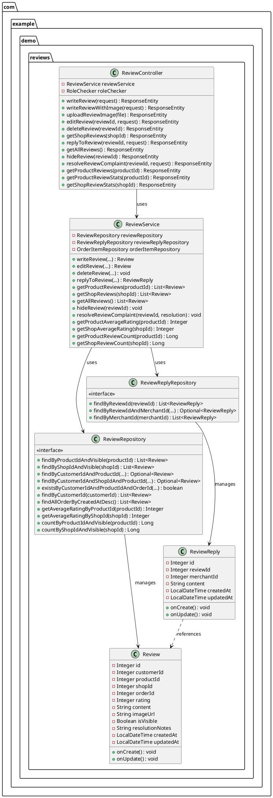
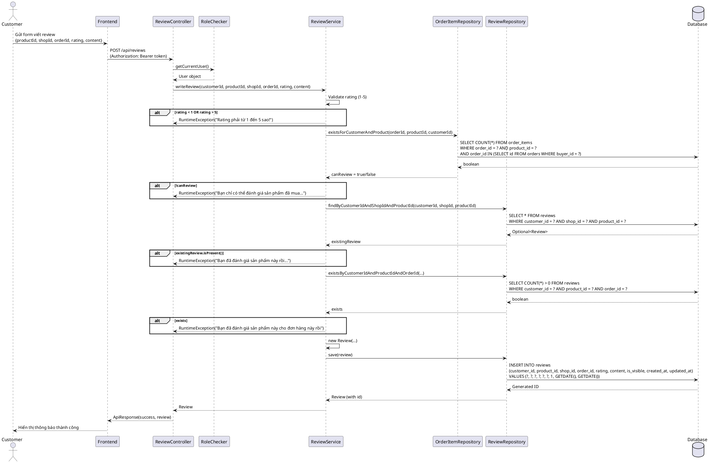
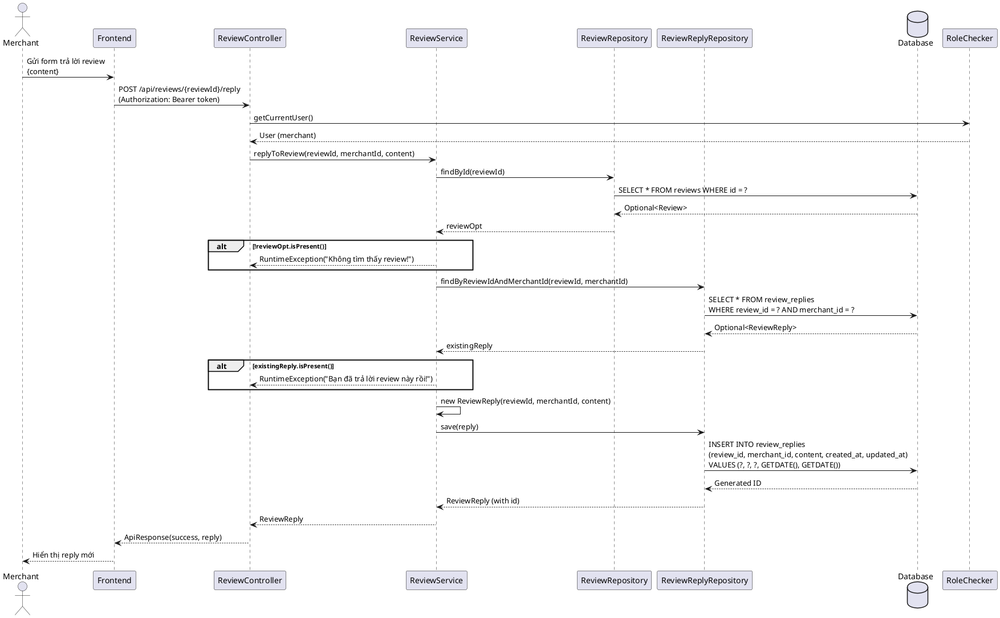
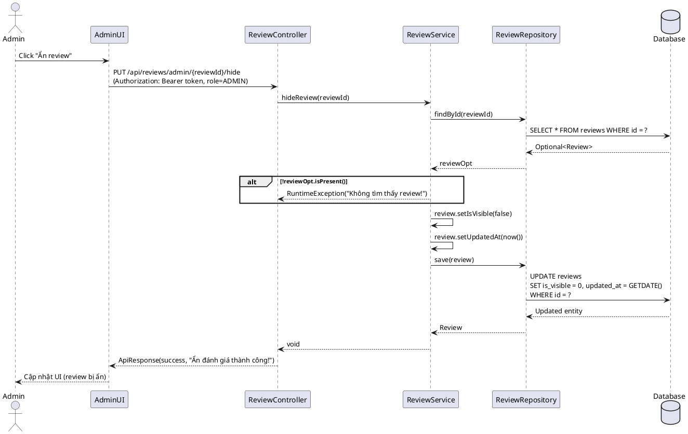
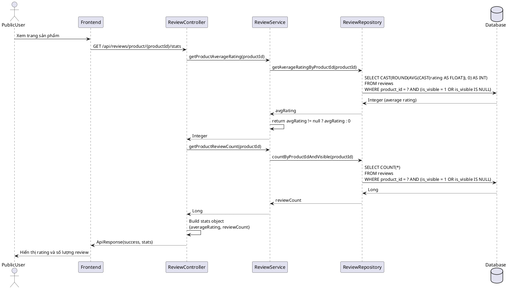

# 2. REVIEW MODULE

## 2.1. Class Diagram



## 2.2. Class Specifications

### 2.2.1. Review (Entity)

**Mục đích**: Entity class đại diện cho bảng `reviews` trong database, lưu trữ đánh giá của khách hàng về sản phẩm/shop.

**Thuộc tính**:
- `id` (Integer): Primary key, tự động tăng
- `customerId` (Integer): ID của khách hàng viết review (NOT NULL)
- `productId` (Integer): ID của sản phẩm được đánh giá (NOT NULL)
- `shopId` (Integer): ID của shop (NOT NULL)
- `orderId` (Integer): ID của đơn hàng liên quan (NULLABLE)
- `rating` (Integer): Điểm đánh giá từ 1-5 sao (NOT NULL)
- `content` (String, NVARCHAR(MAX)): Nội dung đánh giá (NULLABLE)
- `imageUrl` (String): URL ảnh đính kèm (NULLABLE)
- `isVisible` (Boolean): Trạng thái hiển thị, mặc định true (NOT NULL)
- `resolutionNotes` (String, NVARCHAR(MAX)): Ghi chú xử lý khiếu nại của admin (NULLABLE)
- `createdAt` (LocalDateTime): Thời gian tạo, tự động set (NOT NULL)
- `updatedAt` (LocalDateTime): Thời gian cập nhật, tự động set khi update (NULLABLE)

**Phương thức đặc biệt**:
- `onCreate()`: JPA callback, tự động set `isVisible = true`, `createdAt = now()`, `updatedAt = now()` nếu null
- `onUpdate()`: JPA callback, tự động set `updatedAt = now()` khi entity được update

**Constructor**:
- `Review()`: Constructor mặc định cho JPA
- `Review(customerId, productId, shopId, orderId, rating, content)`: Constructor tiện lợi, tự set các giá trị mặc định

---

### 2.2.2. ReviewReply (Entity)

**Mục đích**: Entity class đại diện cho bảng `review_replies`, lưu trữ phản hồi của merchant cho review.

**Thuộc tính**:
- `id` (Integer): Primary key, tự động tăng
- `reviewId` (Integer): ID của review được phản hồi (NOT NULL)
- `merchantId` (Integer): ID của merchant phản hồi (NOT NULL)
- `content` (String, NVARCHAR(MAX)): Nội dung phản hồi (NOT NULL)
- `createdAt` (LocalDateTime): Thời gian tạo, tự động set (NOT NULL)
- `updatedAt` (LocalDateTime): Thời gian cập nhật (NULLABLE)

**Phương thức đặc biệt**:
- `onCreate()`: JPA callback, tự động set timestamps nếu null
- `onUpdate()`: JPA callback, tự động set `updatedAt = now()`

**Constructor**:
- `ReviewReply()`: Constructor mặc định cho JPA
- `ReviewReply(reviewId, merchantId, content)`: Constructor tiện lợi

---

### 2.2.3. ReviewService

**Mục đích**: Service layer xử lý business logic cho review system, bao gồm validation, authorization, và business rules.

**Dependencies**:
- `ReviewRepository`: Spring Data JPA repository để truy cập bảng reviews
- `ReviewReplyRepository`: Spring Data JPA repository để truy cập bảng review_replies
- `OrderItemRepository`: Repository để kiểm tra customer đã mua sản phẩm chưa

**Phương thức chính - Customer Use Cases**:

1. **writeReview(customerId, productId, shopId, orderId, rating, content)**
   - **Mục đích**: Customer viết review cho sản phẩm sau khi mua hàng
   - **Validation**:
     - Rating phải từ 1-5, nếu không throw RuntimeException
     - OrderId phải hợp lệ và thuộc về customer, có chứa đúng product
     - Kiểm tra customer chưa đánh giá sản phẩm/shop này (tránh duplicate)
     - Kiểm tra chưa đánh giá cho cùng (customer, product, order)
   - **Business Logic**:
     - Nếu productId = -1 (review shop), chuyển thành productId = 1 để tránh foreign key constraint
     - Tự động set `isVisible = true`
   - **Return**: Review đã được lưu

2. **writeReview(customerId, productId, shopId, orderId, rating, content, imageUrl)** (Overload)
   - Tương tự như trên, nhưng có thêm imageUrl
   - Gọi method trên trước, sau đó set imageUrl

3. **editReview(reviewId, customerId, rating, content)**
   - **Mục đích**: Customer chỉnh sửa review đã viết
   - **Validation**:
     - Review phải tồn tại, nếu không throw RuntimeException
     - Kiểm tra quyền sở hữu (customerId phải khớp)
     - Rating phải từ 1-5
   - **Business Logic**: Tự động cập nhật `updatedAt`
   - **Return**: Review đã được cập nhật

4. **deleteReview(reviewId, customerId)**
   - **Mục đích**: Customer xóa review của mình
   - **Validation**:
     - Review phải tồn tại
     - Kiểm tra quyền sở hữu
   - **Business Logic**: Xóa tất cả reply liên quan trước, sau đó xóa review
   - **Return**: void

**Phương thức chính - Merchant Use Cases**:

5. **getShopReviews(shopId)**
   - **Mục đích**: Merchant xem tất cả review của shop (chỉ reviews visible)
   - **Return**: List<Review>

6. **replyToReview(reviewId, merchantId, content)**
   - **Mục đích**: Merchant trả lời review của customer
   - **Validation**:
     - Review phải tồn tại
     - Kiểm tra merchant chưa reply review này (tránh duplicate)
   - **Return**: ReviewReply đã được lưu

**Phương thức chính - Admin Use Cases**:

7. **getAllReviews()**
   - **Mục đích**: Admin xem tất cả review trên platform (bao gồm cả invisible)
   - **Return**: List<Review>

8. **hideReview(reviewId)**
   - **Mục đích**: Admin ẩn review vi phạm
   - **Validation**: Review phải tồn tại
   - **Business Logic**: Set `isVisible = false`, cập nhật `updatedAt`
   - **Return**: void

9. **resolveReviewComplaint(reviewId, resolution)**
   - **Mục đích**: Admin xử lý khiếu nại về review
   - **Validation**: Review phải tồn tại
   - **Business Logic**: 
     - Lưu resolution notes (trim whitespace, nếu empty thì set null)
     - Cập nhật `updatedAt`
   - **Return**: void

**Helper Methods**:

10. **getProductReviews(productId)**: Lấy reviews của sản phẩm (visible only)
11. **getCustomerReviews(customerId)**: Lấy tất cả reviews của customer
12. **getProductAverageRating(productId)**: Tính rating trung bình của sản phẩm
13. **getShopAverageRating(shopId)**: Tính rating trung bình của shop
14. **getProductReviewCount(productId)**: Đếm số reviews của sản phẩm
15. **getShopReviewCount(shopId)**: Đếm số reviews của shop
16. **getReviewReplies(reviewId)**: Lấy replies của review

---

### 2.2.4. ReviewController

**Mục đích**: REST API controller xử lý HTTP requests cho review endpoints.

**Base Path**: `/api/reviews`

**Dependencies**:
- `ReviewService`: Service layer
- `RoleChecker`: Utility để lấy current user từ JWT token

**Endpoints cho Customer (yêu cầu role CUSTOMER/BUYER)**:

1. **POST `/`**
   - **Mục đích**: Customer viết review
   - **Security**: `@PreAuthorize("hasAnyRole('CUSTOMER', 'customer', 'BUYER', 'buyer')")`
   - **Request body**: `{productId, shopId, orderId, rating, content}`
   - **Return**: `ApiResponse<Review>`

2. **POST `/with-image`**
   - **Mục đích**: Customer viết review kèm ảnh
   - **Security**: `@PreAuthorize("hasAnyRole('CUSTOMER', 'customer', 'BUYER', 'buyer')")`
   - **Request body**: `{productId, shopId, orderId, rating, content, imageUrl}`
   - **Return**: `ApiResponse<Review>`

3. **POST `/image`**
   - **Mục đích**: Upload ảnh review (trả về URL)
   - **Security**: `@PreAuthorize("isAuthenticated()")`
   - **Request**: Multipart form data với field `file`
   - **Return**: `ApiResponse<{url: string}>`

4. **PUT `/{reviewId}`**
   - **Mục đích**: Customer chỉnh sửa review
   - **Security**: `@PreAuthorize("hasAnyRole('CUSTOMER', 'customer', 'BUYER', 'buyer')")`
   - **Request body**: `{rating, content}`
   - **Return**: `ApiResponse<Review>`

5. **DELETE `/{reviewId}`**
   - **Mục đích**: Customer xóa review
   - **Security**: `@PreAuthorize("hasAnyRole('CUSTOMER', 'customer', 'BUYER', 'buyer')")`
   - **Return**: `ApiResponse<String>`

6. **GET `/customer/my-reviews`**
   - **Mục đích**: Customer xem tất cả reviews của mình
   - **Security**: `@PreAuthorize("hasRole('CUSTOMER')")`
   - **Return**: `ApiResponse<List<Review>>`

**Endpoints cho Merchant**:

7. **GET `/shop/{shopId}`**
   - **Mục đích**: Xem reviews của shop (public access)
   - **Return**: `ApiResponse<List<Review>>`

8. **POST `/{reviewId}/reply`**
   - **Mục đích**: Merchant trả lời review
   - **Security**: `@PreAuthorize("hasRole('SELLER')")`
   - **Request body**: `{content}`
   - **Return**: `ApiResponse<ReviewReply>`

**Endpoints cho Admin**:

9. **GET `/admin/all`**
   - **Mục đích**: Admin xem tất cả reviews
   - **Security**: `@PreAuthorize("hasRole('ADMIN')")`
   - **Return**: `ApiResponse<List<Review>>`

10. **PUT `/admin/{reviewId}/hide`**
    - **Mục đích**: Admin ẩn review
    - **Security**: `@PreAuthorize("hasRole('ADMIN')")`
    - **Return**: `ApiResponse<String>`

11. **PUT `/admin/{reviewId}/resolve`**
    - **Mục đích**: Admin xử lý khiếu nại
    - **Security**: `@PreAuthorize("hasRole('ADMIN')")`
    - **Request body**: `{resolution}`
    - **Return**: `ApiResponse<String>`

**Public Endpoints**:

12. **GET `/product/{productId}`**
    - **Mục đích**: Xem reviews của sản phẩm (public)
    - **Return**: `ApiResponse<List<Review>>`

13. **GET `/product/{productId}/stats`**
    - **Mục đích**: Lấy thống kê rating của sản phẩm (public)
    - **Return**: `ApiResponse<{averageRating, reviewCount}>`

14. **GET `/shop/{shopId}/stats`**
    - **Mục đích**: Lấy thống kê rating của shop (public)
    - **Return**: `ApiResponse<{averageRating, reviewCount}>`

15. **GET `/{reviewId}/replies`**
    - **Mục đích**: Lấy replies của review (public)
    - **Return**: `ApiResponse<List<ReviewReply>>`

---

### 2.2.5. ReviewRepository

**Mục đích**: Spring Data JPA Repository interface để truy cập bảng `reviews`.

**Extends**: `JpaRepository<Review, Integer>`

**Custom Query Methods**:

1. **findByProductIdAndVisible(productId)** (Native Query)
   - Lấy reviews của sản phẩm (chỉ visible)
   - Query: `SELECT ... FROM reviews WHERE product_id = ? AND (is_visible = 1 OR is_visible IS NULL) ORDER BY created_at DESC`

2. **findByShopIdAndVisible(shopId)** (Native Query)
   - Lấy reviews của shop (chỉ visible)
   - Query: `SELECT ... FROM reviews WHERE shop_id = ? AND (is_visible = 1 OR is_visible IS NULL) ORDER BY created_at DESC`

3. **findByCustomerIdAndProductId(customerId, productId)** (JPQL)
   - Lấy review của customer cho sản phẩm cụ thể
   - Query: `SELECT r FROM Review r WHERE r.customerId = :customerId AND r.productId = :productId`

4. **findByCustomerIdAndShopIdAndProductId(customerId, shopId, productId)** (JPQL)
   - Lấy review của customer cho shop cụ thể
   - Query: `SELECT r FROM Review r WHERE r.customerId = :customerId AND r.shopId = :shopId AND r.productId = :productId`

5. **existsByCustomerIdAndProductIdAndOrderId(customerId, productId, orderId)**
   - Kiểm tra đã tồn tại review cho cùng (customer, product, order)
   - Generated query: `SELECT COUNT(*) > 0 FROM reviews WHERE customer_id = ? AND product_id = ? AND order_id = ?`

6. **findByCustomerId(customerId)** (JPQL)
   - Lấy tất cả reviews của customer
   - Query: `SELECT r FROM Review r WHERE r.customerId = :customerId ORDER BY r.createdAt DESC`

7. **findAllOrderByCreatedAtDesc()** (JPQL)
   - Lấy tất cả reviews (admin only, bao gồm cả invisible)
   - Query: `SELECT r FROM Review r ORDER BY r.createdAt DESC`

8. **getAverageRatingByProductId(productId)** (Native Query)
   - Tính rating trung bình của sản phẩm
   - Query: `SELECT CAST(ROUND(AVG(CAST(rating AS FLOAT)), 0) AS INT) FROM reviews WHERE product_id = ? AND (is_visible = 1 OR is_visible IS NULL)`

9. **getAverageRatingByShopId(shopId)** (Native Query)
   - Tính rating trung bình của shop
   - Query: `SELECT CAST(ROUND(AVG(CAST(rating AS FLOAT)), 0) AS INT) FROM reviews WHERE shop_id = ? AND (is_visible = 1 OR is_visible IS NULL)`

10. **countByProductIdAndVisible(productId)** (Native Query)
    - Đếm số reviews của sản phẩm
    - Query: `SELECT COUNT(*) FROM reviews WHERE product_id = ? AND (is_visible = 1 OR is_visible IS NULL)`

11. **countByShopIdAndVisible(shopId)** (Native Query)
    - Đếm số reviews của shop
    - Query: `SELECT COUNT(*) FROM reviews WHERE shop_id = ? AND (is_visible = 1 OR is_visible IS NULL)`

---

### 2.2.6. ReviewReplyRepository

**Mục đích**: Spring Data JPA Repository interface để truy cập bảng `review_replies`.

**Extends**: `JpaRepository<ReviewReply, Integer>`

**Custom Query Methods**:

1. **findByReviewId(reviewId)** (JPQL)
   - Lấy tất cả replies của review
   - Query: `SELECT rr FROM ReviewReply rr WHERE rr.reviewId = :reviewId ORDER BY rr.createdAt ASC`

2. **findByReviewIdAndMerchantId(reviewId, merchantId)** (JPQL)
   - Lấy reply của merchant cho review cụ thể
   - Query: `SELECT rr FROM ReviewReply rr WHERE rr.reviewId = :reviewId AND rr.merchantId = :merchantId`

3. **findByMerchantId(merchantId)** (JPQL)
   - Lấy tất cả replies của merchant
   - Query: `SELECT rr FROM ReviewReply rr WHERE rr.merchantId = :merchantId ORDER BY rr.createdAt DESC`

---

## 2.3. Sequence Diagrams

### 2.3.1. Customer Viết Review



### 2.3.2. Merchant Trả Lời Review



### 2.3.3. Admin Ẩn Review



### 2.3.4. Public Xem Thống Kê Rating Sản Phẩm



---

## 2.4. Database Queries

### 2.4.1. Schema

**Table: `reviews`**

```sql
CREATE TABLE reviews (
    id INT IDENTITY(1,1) PRIMARY KEY,
    customer_id INT NOT NULL,
    product_id INT NOT NULL,
    shop_id INT NOT NULL,
    order_id INT NULL,
    rating INT NOT NULL CHECK (rating >= 1 AND rating <= 5),
    content NVARCHAR(MAX) NULL,
    image_url NVARCHAR(500) NULL,
    is_visible BIT NOT NULL DEFAULT 1,
    resolution_notes NVARCHAR(MAX) NULL,
    created_at DATETIME2 NOT NULL DEFAULT GETDATE(),
    updated_at DATETIME2 NULL DEFAULT GETDATE()
);

CREATE INDEX idx_reviews_customer_id ON reviews(customer_id);
CREATE INDEX idx_reviews_product_id ON reviews(product_id);
CREATE INDEX idx_reviews_shop_id ON reviews(shop_id);
CREATE INDEX idx_reviews_order_id ON reviews(order_id);
CREATE INDEX idx_reviews_is_visible ON reviews(is_visible);
CREATE INDEX idx_reviews_created_at ON reviews(created_at DESC);
```

**Table: `review_replies`**

```sql
CREATE TABLE review_replies (
    id INT IDENTITY(1,1) PRIMARY KEY,
    review_id INT NOT NULL,
    merchant_id INT NOT NULL,
    content NVARCHAR(MAX) NOT NULL,
    created_at DATETIME2 NOT NULL DEFAULT GETDATE(),
    updated_at DATETIME2 NULL DEFAULT GETDATE(),
    FOREIGN KEY (review_id) REFERENCES reviews(id) ON DELETE CASCADE
);

CREATE INDEX idx_review_replies_review_id ON review_replies(review_id);
CREATE INDEX idx_review_replies_merchant_id ON review_replies(merchant_id);
```

### 2.4.2. Queries Generated by Spring Data JPA

**1. Lấy reviews của sản phẩm (visible only)**
```sql
SELECT id, customer_id, product_id, shop_id, order_id, rating, content, 
       image_url, is_visible, created_at, updated_at, resolution_notes 
FROM reviews 
WHERE product_id = ? 
  AND (is_visible = 1 OR is_visible IS NULL) 
ORDER BY created_at DESC;
```

**2. Lấy reviews của shop (visible only)**
```sql
SELECT id, customer_id, product_id, shop_id, order_id, rating, content, 
       image_url, is_visible, created_at, updated_at, resolution_notes 
FROM reviews 
WHERE shop_id = ? 
  AND (is_visible = 1 OR is_visible IS NULL) 
ORDER BY created_at DESC;
```

**3. Kiểm tra customer đã đánh giá sản phẩm chưa**
```sql
SELECT r FROM Review r 
WHERE r.customerId = :customerId 
  AND r.productId = :productId;
```

**4. Kiểm tra đã tồn tại review cho cùng (customer, product, order)**
```sql
SELECT COUNT(*) > 0 
FROM reviews 
WHERE customer_id = ? 
  AND product_id = ? 
  AND order_id = ?;
```

**5. Lấy tất cả reviews của customer**
```sql
SELECT r FROM Review r 
WHERE r.customerId = :customerId 
ORDER BY r.createdAt DESC;
```

**6. Lấy tất cả reviews (admin, bao gồm cả invisible)**
```sql
SELECT r FROM Review r 
ORDER BY r.createdAt DESC;
```

**7. Tính rating trung bình của sản phẩm**
```sql
SELECT CAST(ROUND(AVG(CAST(rating AS FLOAT)), 0) AS INT) 
FROM reviews 
WHERE product_id = ? 
  AND (is_visible = 1 OR is_visible IS NULL);
```

**8. Tính rating trung bình của shop**
```sql
SELECT CAST(ROUND(AVG(CAST(rating AS FLOAT)), 0) AS INT) 
FROM reviews 
WHERE shop_id = ? 
  AND (is_visible = 1 OR is_visible IS NULL);
```

**9. Đếm số reviews của sản phẩm**
```sql
SELECT COUNT(*) 
FROM reviews 
WHERE product_id = ? 
  AND (is_visible = 1 OR is_visible IS NULL);
```

**10. Đếm số reviews của shop**
```sql
SELECT COUNT(*) 
FROM reviews 
WHERE shop_id = ? 
  AND (is_visible = 1 OR is_visible IS NULL);
```

**11. Lấy replies của review**
```sql
SELECT rr FROM ReviewReply rr 
WHERE rr.reviewId = :reviewId 
ORDER BY rr.createdAt ASC;
```

**12. Kiểm tra merchant đã reply review chưa**
```sql
SELECT rr FROM ReviewReply rr 
WHERE rr.reviewId = :reviewId 
  AND rr.merchantId = :merchantId;
```

### 2.4.3. Queries Thực Thi Bởi Service Methods

**1. Tạo review mới**
```sql
INSERT INTO reviews (customer_id, product_id, shop_id, order_id, rating, content, 
                     image_url, is_visible, created_at, updated_at)
VALUES (?, ?, ?, ?, ?, ?, ?, 1, GETDATE(), GETDATE());
```

**2. Cập nhật review (edit)**
```sql
UPDATE reviews 
SET rating = ?, 
    content = ?, 
    updated_at = GETDATE() 
WHERE id = ?;
```

**3. Ẩn review (admin)**
```sql
UPDATE reviews 
SET is_visible = 0, 
    updated_at = GETDATE() 
WHERE id = ?;
```

**4. Xử lý khiếu nại (admin)**
```sql
UPDATE reviews 
SET resolution_notes = ?, 
    updated_at = GETDATE() 
WHERE id = ?;
```

**5. Xóa review (cascade delete replies)**
```sql
-- Xóa replies trước
DELETE FROM review_replies WHERE review_id = ?;

-- Xóa review
DELETE FROM reviews WHERE id = ?;
```

**6. Tạo reply mới**
```sql
INSERT INTO review_replies (review_id, merchant_id, content, created_at, updated_at)
VALUES (?, ?, ?, GETDATE(), GETDATE());
```

### 2.4.4. Performance Optimization

- **Indexes**: 
  - Composite index `(product_id, is_visible, created_at)` có thể tối ưu query lấy reviews của sản phẩm
  - Composite index `(shop_id, is_visible, created_at)` cho query lấy reviews của shop
  - Index `(customer_id, product_id, shop_id)` cho query kiểm tra duplicate review

- **Query Optimization**:
  - Sử dụng native query cho các aggregation (AVG, COUNT) để tăng hiệu năng
  - Filter `is_visible` trong WHERE clause để giảm số lượng rows cần scan
  - CASCADE DELETE cho `review_replies` khi xóa review để đảm bảo data integrity


